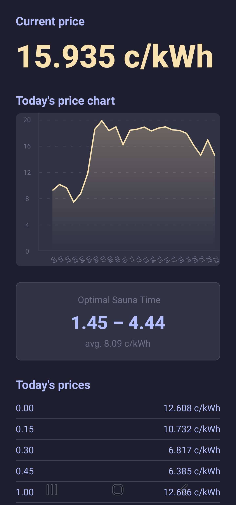

## Week 7 Electricity price app

Mobile app which fetches electricity prices of the current day and displays them as a chart and a list. Additionally displays optimal 3 hour "sauna time" for sauna enthusiasts.

## Workflow

1. Find and receive data from API. I ended up using https://api.porssisahko.net/v2/latest-prices.json for the API.
2. After receiving data from the API, I had to clean it up before using it. The JSON came in form of

```
"prices": [
    {
      "price": 12.273,
      "startDate": "2026-02-23T22:45:00.000Z",
      "endDate": "2026-02-23T22:59:59.999Z"
    }
```
And it had prices of last three days (including current day). I filtered only the current day's prices and converted them from UTC to UTC +2 (Finnish time).

3. Now that my data was in "usable" form I could start implementing actual features.
4. At first I added the current price. I had to define current time and find matching price from the filtered JSON data.
5. After that I listed the filtered JSON data from 00:00 to 23:45 displaying the time.
6. Next up I wanted to display chart. I went through several different charts until I got this one working and ended up using this https://www.npmjs.com/package/react-native-gifted-charts which was fairly simple compared to other counterparts I tried.
7. Last but not least the "Sauna Time". I wanted to display optimal sauna time of the day by finding the smallest average price of three (3) consecutive hours. I ended up using nested for loop which checks 12 x 15min slots and checks the average price of those price points.

## Structure
```
App.tsx                           — root component, renders all sections
colors.ts                         — color palette
hooks/
  useElectricityPrice.ts          — fetches and filters today's prices
components/
  PriceChart.tsx                  — hourly line chart
  SaunaTimer.tsx                  — optimal 3-hour sauna window
```
## Summary

This was a very fun task, since we got to be creative and I have had actual applications in mind for this kind of app, so I got to somewhat test out in advance how this is working.
The workflow was very straight forward in my mind but I ended up struggling with fairly simple things like data being in UTC +2 time, but after getting data filtered to correct format this was very easy and intuitive task.


